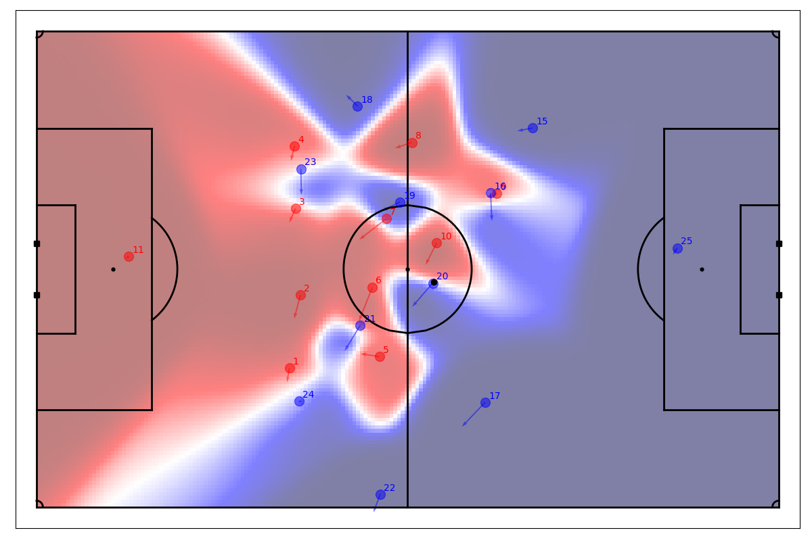

# Tracking-PitchControl

This code uses Metrica tracking data to generate Pitch Control surfaces (also called Potential Pitch Control Fields, PPCFs), as defined in the work "Beyond Expected Goals" [[Spearman, 2018](https://www.researchgate.net/publication/327139841_Beyond_Expected_Goals)]. 

This repository assumes that the user has the Metrica tracking and event data (found [here](https://github.com/metrica-sports/sample-data)) in the directory (the default location is ```"../sample-data/data/"```).

Due to the lack of more data to train a model on, the code for the default model parameters was taken directly from Laurie Shaw's tracking data [tutorial](https://github.com/Friends-of-Tracking-Data-FoTD/LaurieOnTracking) on the Friends of Tracking Data (FoTD) repo (which were taken from the original work by Spearman). The functions in ```Visualization.py``` for pitch plotting have been taken from Laurie's tutorial. 

Some things to note to contrast this to other implementations of this online ([here](https://www.youtube.com/watch?v=5X1cSehLg6s&t=1017s&ab_channel=FriendsofTracking) and [here](https://www.youtube.com/watch?v=F-TSU-UKVA0&t=13s&ab_channel=DavidSumpter)):   
1. The use of the maximum acceleration of the players, and using a nuanced equation of motion to compute the time-to-intercept, which includes the time for the player to get to their maximum velocity.

2. The ability to have ```vmax``` and ```amax``` be player-specific.

The current state of the code allows the user to input a Game number and Frame in ```Main.py```. For example, in ```Sample_Game_1``` at frame ```832```, the code generates a figure that looks like this: 



## Requirements
The packages used in the code can be installed using the code below: 
```
pip3 install numpy
pip3 install matplotlib
pip3 install pandas
pip3 install itertools 
````

## Options (in ```Main.py```)

1. ```path_to_data```: Place where the Metrica data files are stored. Default is ```../sample-data/data/```.
2. ```match_name```: Which game from the Metrica dataset is used for plotting. Valid inputs here are ```Sample_Game_X```, where ```X``` is ```1```, ```2```, or ```3```.

3. ```frame```: Which frame the user wants to look at. 

4. ```include_player_velocities```: Set to ```True``` to show the player velocities in the plot. 

5. ```show```: Set to ```True``` to show the plot. In all cases, the plot will be saved in the ```Figures/``` directory. 


## Functionality that is coming soon

1. Paralellization of PPCF evaluation on the full pitch (the fastest way is to use ```numba```, but this package does not play well with Pandas structures and dictionaries, so there is a small amount of type-changing that needs to be done. The usual ```multiproecessing``` methods for this problem do not show a marked improvement in terms of time.)
   
2. Using event frame data to generate a "movie" of the events and pitch control surface evolution leading up to the event (eg. looking at the passes leading up to a goal, or analyzing buildup play). 

